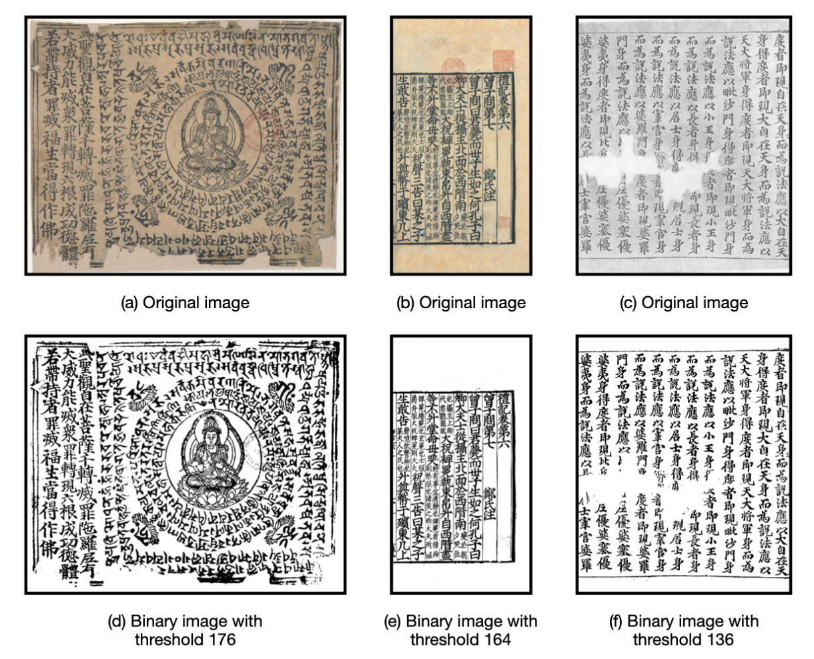
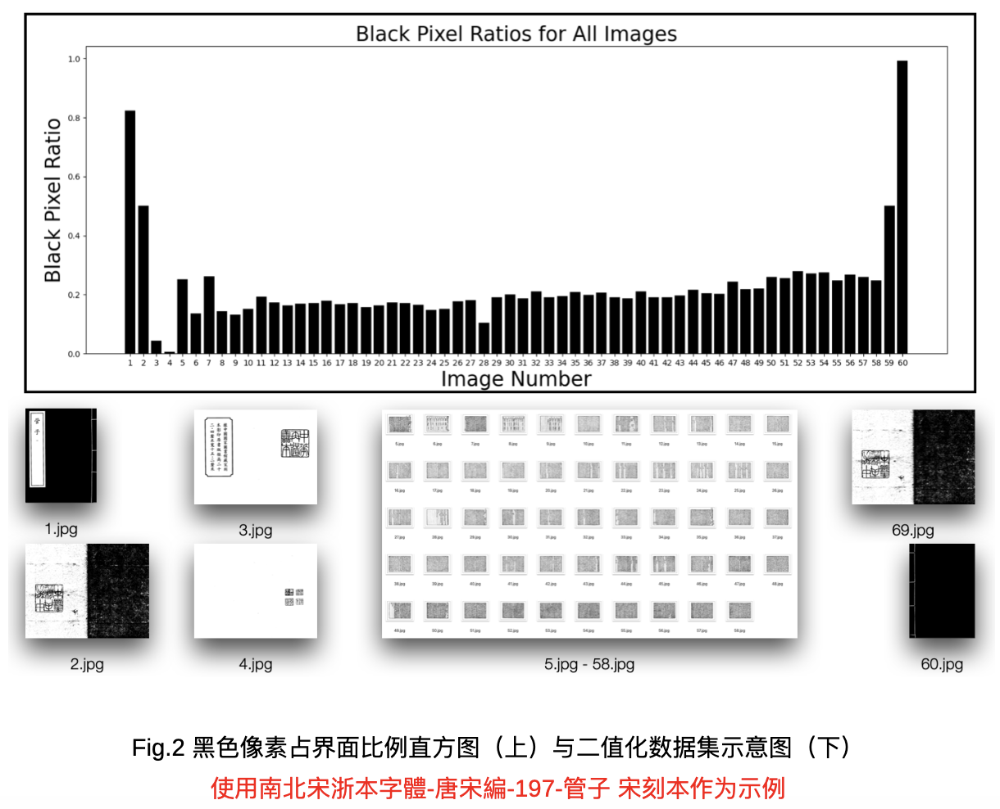

# Ancient-book-Edition-Identification

This repository is used for the preprocessing of scanned pages in ancient book edition identification tasks. It includes four major steps: `binarization`, `removal of auxiliary text pages`, `cropping of page borders`, and `image chunking`. The specific usage is as follows or refer to `test.py`.

#### STEP 0 - Install Dependencies
```
pip install -r requirements.txt
```

#### STEP 1 - Rename Original Data
After storing the original dataset locally, you can use the `books_rename` function to rename all images in the subfolders of the specified path with numerical indices for easier subsequent reading.
```
from processing.rename import books_rename
books_rename(input_folder)
```

#### STEP 2 - Image Binarization
Due to the impact of storage conditions, ancient books often suffer from yellowing, damage, stains, and other noise issues.  
The `images_binarization` function converts scanned images to grayscale, applies Otsu’s global threshold selection, and performs binarization. The processed images are then saved in a new folder.
```
from processing.otsu import images_binarization
images_binarization(input_folder, output_folder)
```

<center>Otsu Threshold Selection and Binarization Effect</center>

#### STEP 3 - Remove Auxiliary Text
Since the original dataset contains entire scanned books, non-relevant auxiliary texts such as covers, prefaces, and colophons are included.  
The `books_remove_covers` function calculates the proportion of black pixels in an image and filters out those with less than 15% or more than 35% black pixels (auxiliary text). The filtered images are saved in a new folder.
```
from processing.remove_covers import books_remove_covers
books_remove_covers(input_folder, output_folder)
```

<center>Threshold Determination for Auxiliary Text Removal (Black pixel ratio in the main text is usually between 15%-35%)</center>

#### STEP 4 - Crop Page Borders
Since page borders may contain minimal textual information and could affect classification results after chunking,  
the `images_crop_border` function uses the projection method to detect the longest black line in half a page as the border and crops the image accordingly. The cropped images are saved in a new folder.
```
from processing.remove_bounders import images_crop_border
images_crop_border(input_folder, output_folder)
```

#### STEP 5 - Image Chunking
To increase the dataset size and optimize it for neural network input size (299 works well for Inception-Resnet Network),  
the `images_chunking` function slices the images into smaller chunks and saves them in a new folder.
```
from processing.chunking import images_chunking
images_chunking(input_folder, output_folder, chunk_size)
```

#### STEP 6 - Remove Blank Chunks
The `chunks_remove_blanks` function filters out chunks with insufficient text content.  
By default, chunks with a black pixel ratio lower than 8% are considered blank and removed. The filtered images are saved in a new folder.
```
from processing.remove_blanks import chunks_remove_blanks
chunks_remove_blanks(input_folder, output_folder)
```
